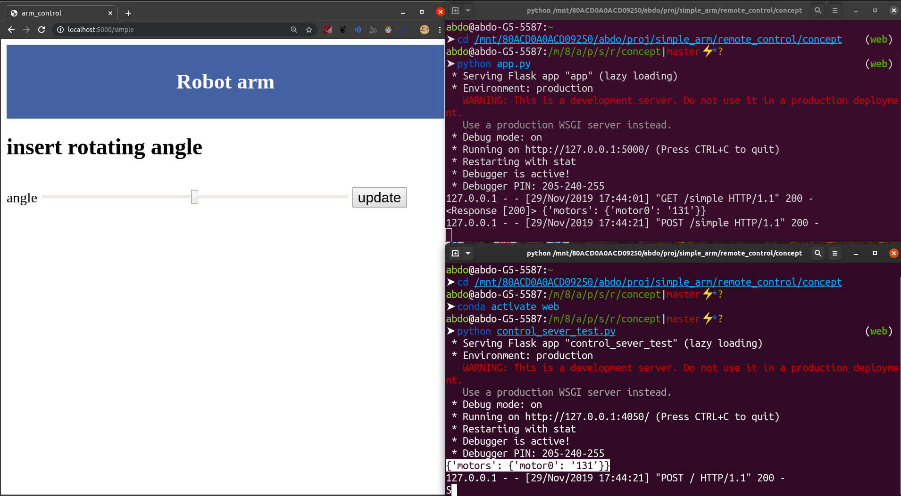

# middle server implemetation

implemetating middle server that communicate with control-server and end-user

# run server
make sure u installed flask ,request in python env
> `pip install -r requirments.txt`

run middle server 
> `python app.py`

run temporary control-srever 

> `python control_server_test.py`

* __will open in port defined at [connection](connection.json)__

you can now open `http://localhost:5000/simple`

where if you send value to middle server it will pass it in json to control-server

## FAQ

1. why middle server ?
* for a learning project like this i would need to perform a lot in of modifcation in gui and proccessing the data.
* so i decided to use a faster development envivroment instead of flashing every update to esp and wait for result

2. why not using nodemcu ?
* first i dont have the board.
* and  i think we will need more proceesing power for tasks like image proceessing so using python server will be very usful

    *  put i may go for it as it support updating via web with no need reflashing any thing update

3. where is documentaion ?
* will be added soon

2. what will we do next ?
 check out the incomplate [roadmap](../readme.md)
 
 
 
 ## contribution
 * before pushing you may use `pylint file.py` to check your styling errors and fix them
